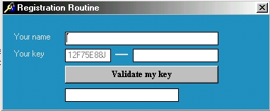



## Registration routine

### Description

For all shareware makers ! and vb developer friends here is a small registration routine you can always include it with your aplications . Note ! do not make nag screens or silly message boxes because its very easy to cracked ! Try this and see, and vote me or write your comments or any sugestion you are most welcome ...
 
### More Info
 

             |
---                |---
**Submitted On**   |2003-01-21 03:39:02
**By**             |[kegham](https://github.com/Planet-Source-Code/PSCIndex/blob/master/ByAuthor/kegham.md)
**Level**          |Intermediate
**User Rating**    |3.5 (14 globes from 4 users)
**Compatibility**  |VB 5\.0, VB 6\.0
**Category**       |[Encryption](https://github.com/Planet-Source-Code/PSCIndex/blob/master/ByCategory/encryption__1-48.md)
**World**          |[Visual Basic](https://github.com/Planet-Source-Code/PSCIndex/blob/master/ByWorld/visual-basic.md)
**Archive File**   |[Registrati1532451212003\.zip](https://github.com/Planet-Source-Code/kegham-registration-routine__1-42611/archive/master.zip)

